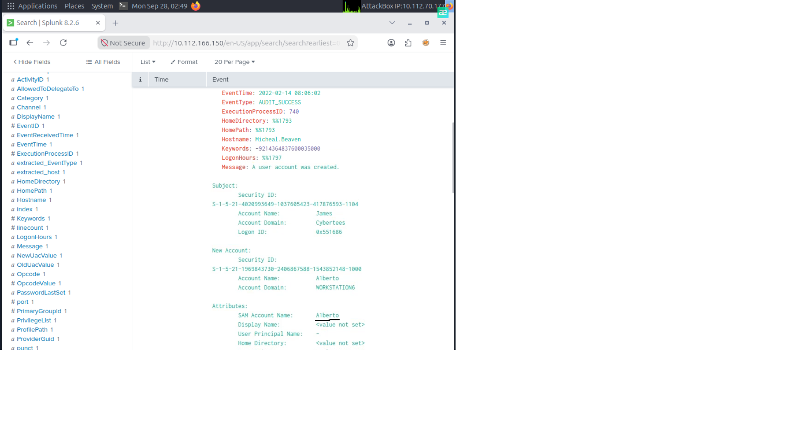
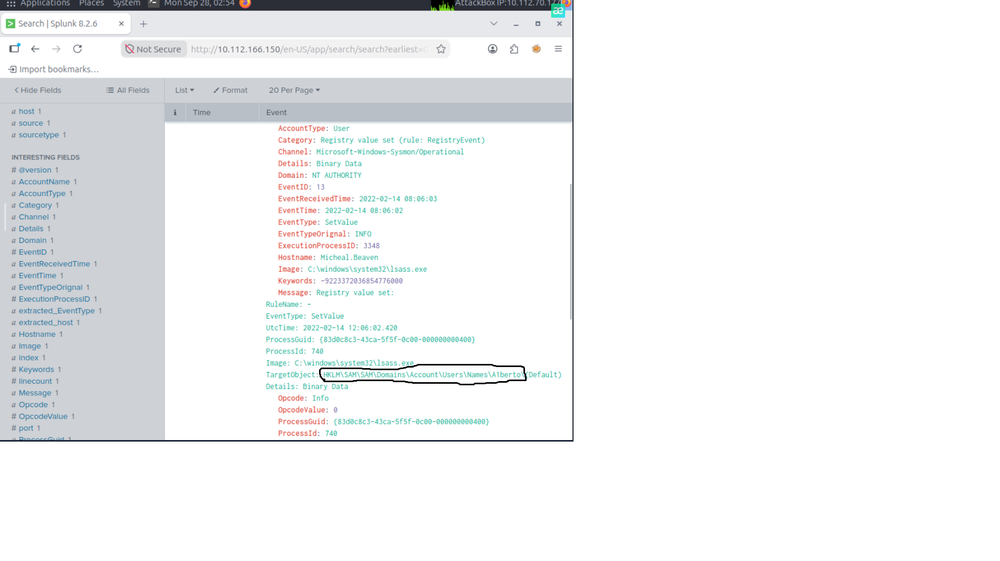
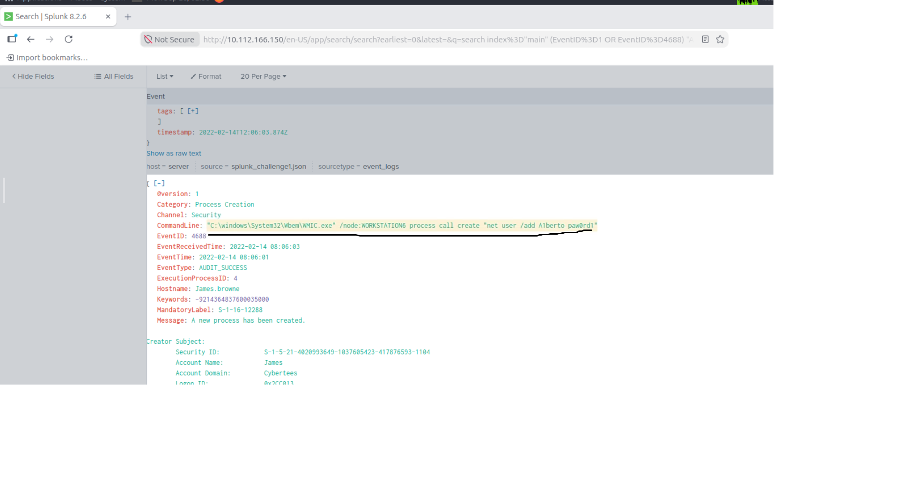
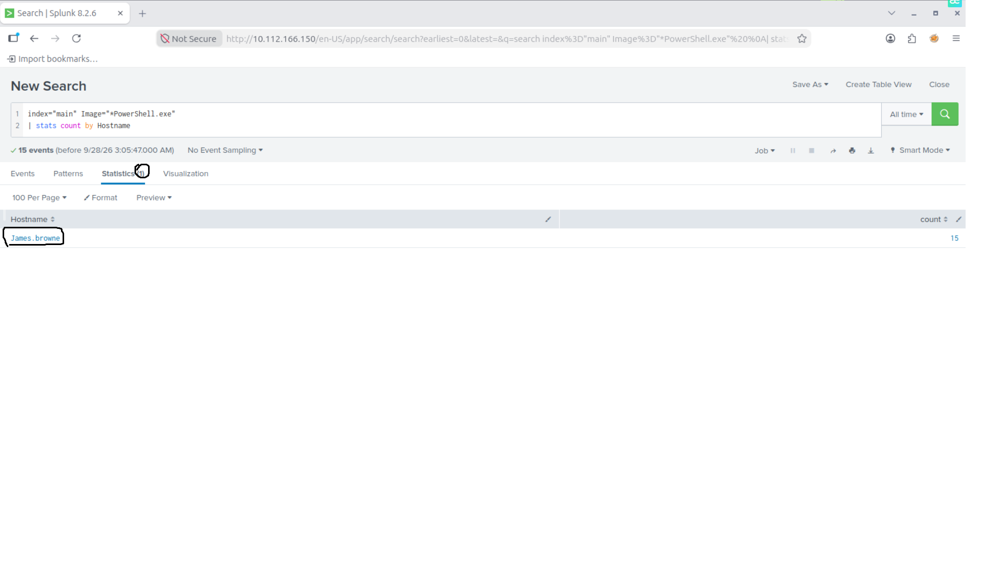
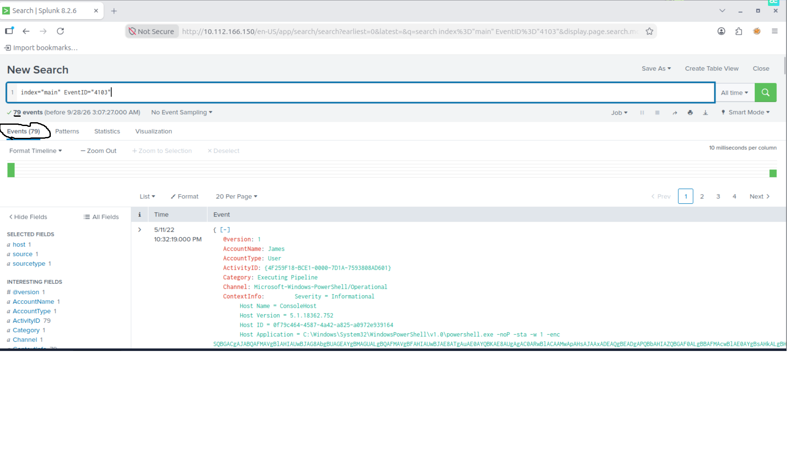
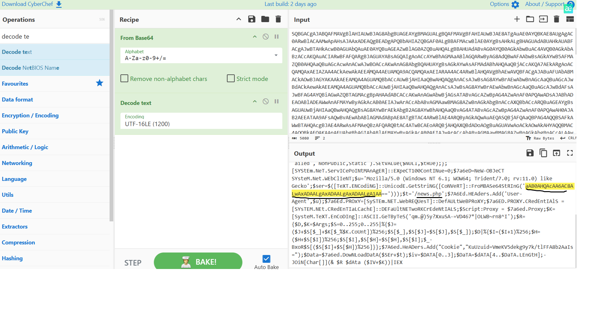
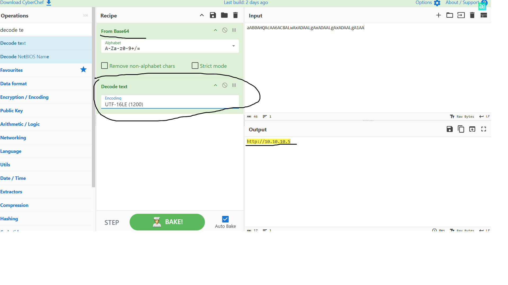

# Investigating with Splunk

## Overview

In this TryHackMe challenge, I investigated Windows event logs using Splunk to identify suspicious activity on a compromised host.

The investigation included identifying a backdoor user, analyzing registry changes, reviewing process creation and login events, and investigating malicious PowerShell activity. I also decoded an encoded PowerShell script to identify its network activity.

## Tools Used

- Splunk
- Windows Event Logs
- Sysmon
- CyberChef

## Investigation

### 1. Initial Log Review

I started by checking the available events in the `main` index.

```spl
index="main"
```

The index contained **12,256 events**.

Instead of reviewing the events manually, I used specific Windows Event IDs and Splunk searches to investigate the suspicious activity.

---

### 2. Backdoor User Investigation

During the investigation, I identified a newly created user account named **A1berto** (impersonating to Alberto username).

Windows Event ID `4720` records the creation of a user account, so I used it to investigate the account creation activity.

```spl
index="main" EventID=4720
```



I then searched for additional activity related to this account.

```spl
index="main" EventID=13 "A1berto"
```

Event ID `13` showed a registry value modification associated with the account.

The affected registry path was located under:

```text
HKLM\SAM\SAM\Domains\Account\Users\Names\A1berto
```



This provided another artifact associated with the creation of the backdoor account.

---

### 3. Remote Account Creation

I searched process creation events for references to the suspicious account.

```spl
index="main" (EventID=1 OR EventID=4688) "A1berto"
```

The logs revealed that `WMIC.exe` was used to remotely execute a command that created the user account.



This was an important finding because it showed how the attacker created the backdoor account from another system.

I also reviewed authentication events associated with the account using Windows Event IDs `4624` and `4625`.

```spl
index="main" (EventID=4624 OR EventID=4625) "A1berto"
```

These Event IDs are useful for investigating successful and failed Windows logon activity.

---

### 4. Identifying the Infected Host

Next, I investigated PowerShell activity.

I searched for PowerShell process execution and grouped the results by hostname:

```spl
index="main" Image="*PowerShell.exe"
| stats count by Hostname
```

The suspicious PowerShell activity was associated with the host:

```text
James.browne
```



This search helped narrow the investigation to the affected system.

---

### 5. PowerShell Investigation

PowerShell logging was enabled on the system, which provided additional information about the malicious execution.

I searched for PowerShell Event ID `4103`:

```spl
index="main" EventID="4103"
```

The search returned **79 events**.



One of the events contained a long encoded PowerShell command. This was a strong indicator that the script required further investigation.

---

### 6. Decoding the PowerShell Script

I extracted the encoded PowerShell data from the event and analyzed it using CyberChef.

The payload was Base64 encoded. After decoding the Base64 data, I used UTF-16LE decoding to make the PowerShell script readable.



The decoded script showed network-related functionality and revealed that the compromised host was making an outbound web request.

Further analysis of the script revealed the full URL contacted during the malicious PowerShell execution.



This provided a useful network IOC that could be used for further investigation or detection.

## Key Findings

- A backdoor user account named `A1berto` was created (impersonating to Alberto username).
- Registry activity related to the new account was identified.
- `WMIC.exe` was used to execute the account creation command remotely.
- Suspicious PowerShell activity was identified on the infected host.
- PowerShell operational logs contained evidence of the malicious execution.
- An encoded PowerShell payload was extracted and decoded.
- The decoded script revealed outbound network activity to an external URL.

## What I Learned

This room helped me understand how different Windows logs can be connected during an investigation instead of analyzing each event separately.

I practiced using Splunk searches to investigate user creation, registry changes, process execution, authentication events, and PowerShell activity.

I also learned how PowerShell logging can provide valuable information during an investigation and how encoded PowerShell commands can be extracted from logs and analyzed with CyberChef.

## Conclusion

This investigation showed how Splunk can be used to reconstruct suspicious activity across multiple Windows event sources.

Starting from a large number of events, I was able to narrow the investigation to a suspicious user account, identify how the account was created, find the affected host, and analyze malicious PowerShell activity that resulted in an external network connection.
