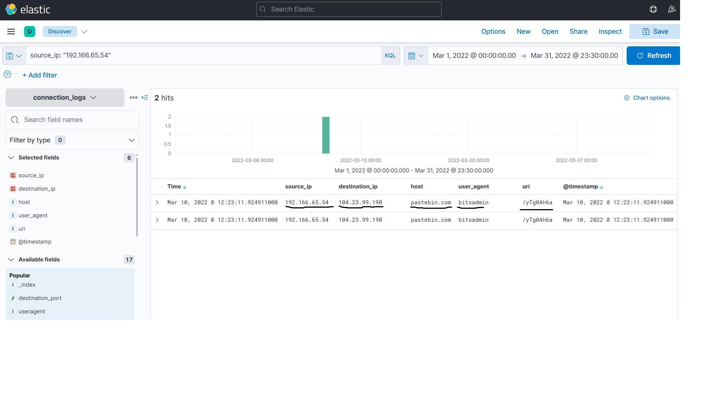
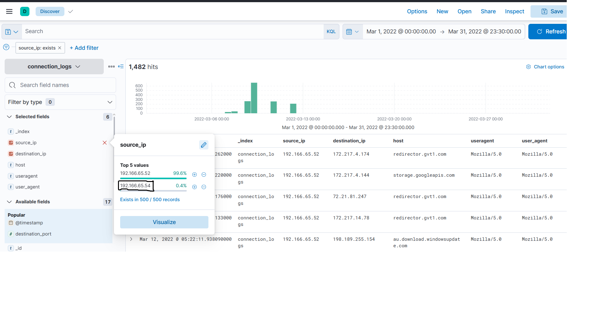
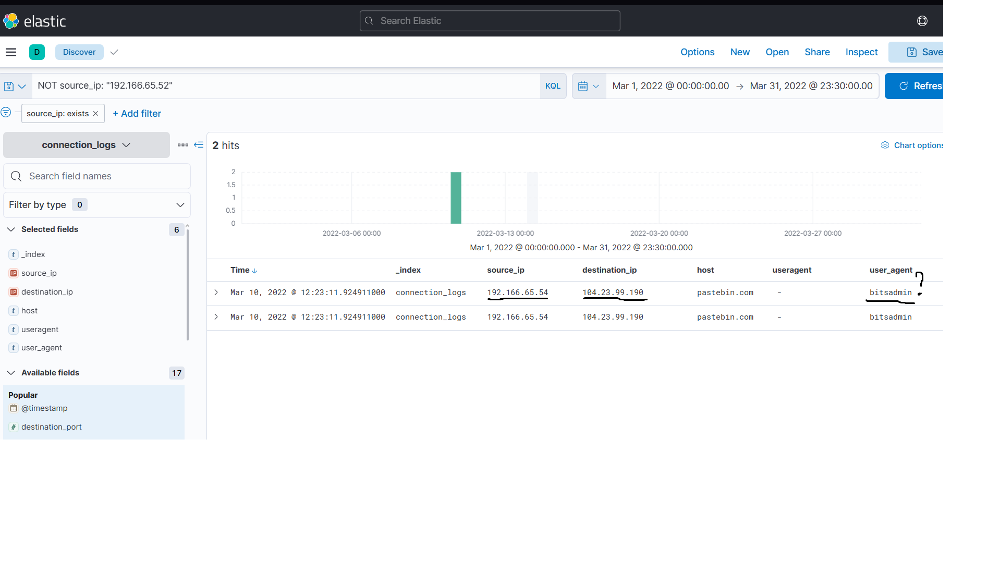
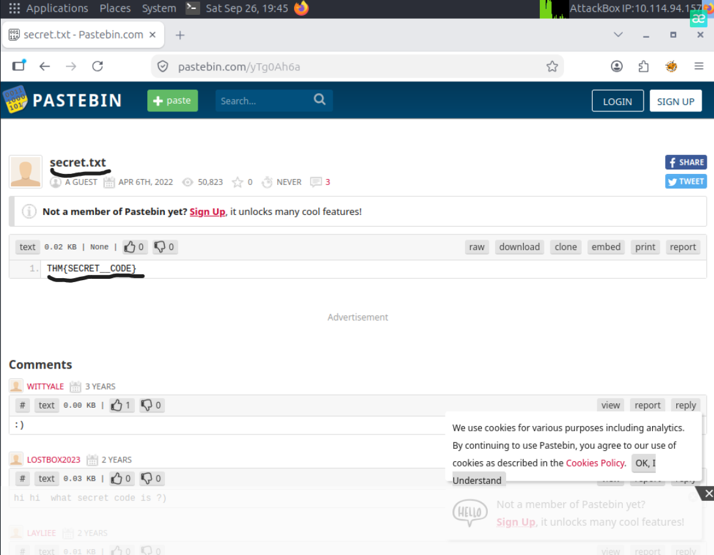

# ItsyBitsy

## Overview

ItsyBitsy is a TryHackMe challenge focused on investigating an IDS alert related to potential Command and Control (C2) communication.

The goal of the investigation was to analyze the available connection logs in Elastic, identify suspicious activity, and determine whether the host was communicating with potential C2 infrastructure.

## Tools Used

- Elastic / Kibana
- KQL
- Web browser

## Initial Analysis

The available dataset contained connection logs from March 2022.

While reviewing the `source_ip` field, I noticed that most of the connection logs originated from one IP address, while only a small number of events were associated with another IP.

The unusual distribution caught my attention, so I decided to investigate the less common source IP: `192.166.65.54`.



## Suspicious IP Investigation

I filtered the connection logs using the following KQL query:

```text
source_ip: "192.166.65.54"
```

The search returned activity associated with:

- Source IP: `192.166.65.54`
- Destination IP: `104.23.99.190`
- Domain: `pastebin.com`
- User agent: `bitsadmin`
- URI: `/yTg0Ah6a`



I also filtered out the IP address responsible for most of the normal activity, which made the unusual events easier to identify.



## BITSAdmin and C2 Activity

One of the interesting findings was the use of `bitsadmin`.

BITSAdmin is a legitimate Windows utility that can be used to manage Background Intelligent Transfer Service (BITS) jobs, including file transfers.

In this investigation, its appearance was unusual because the host was using it while communicating with `pastebin.com`.

This was a useful example of how a legitimate Windows binary can be used for malicious purposes, a technique commonly associated with Living off the Land.

The connection logs also contained the URI:

```text
/yTg0Ah6a
```

By combining the domain and URI, I reconstructed the full URL:

```text
pastebin.com/yTg0Ah6a
```

## Final Artifact

I opened the discovered Pastebin URL in a web browser to investigate the resource.

The page contained a file named:

```text
secret.txt
```

This confirmed that the domain and URI identified in the connection logs led to the expected resource and supported the findings from the log investigation.



## Indicators of Compromise

| Type | Indicator | Context |
| --- | --- | --- |
| Source IP | `192.166.65.54` | Host associated with the suspicious activity |
| Destination IP | `104.23.99.190` | Destination observed in the connection logs |
| Domain | `pastebin.com` | Domain contacted during the suspicious activity |
| URL | `pastebin.com/yTg0Ah6a` | Resource identified during the investigation |

> These indicators are part of the TryHackMe lab environment and are included for educational purposes.

## Investigation Timeline

1. Reviewed the connection logs from March 2022.
2. Identified `192.166.65.54` as an uncommon source IP.
3. Filtered the logs to investigate activity associated with this IP.
4. Identified `bitsadmin`, `pastebin.com`, and the URI `/yTg0Ah6a`.
5. Combined the domain and URI to reconstruct the full URL.
6. Investigated the URL and discovered `secret.txt`.

## What I Learned

This challenge gave me more practice using Elastic and KQL to filter logs and focus on unusual activity.

I improved my understanding of how an investigation can start with one suspicious artifact, such as an IP address, and then pivot to related information such as a destination IP, domain, user agent, and URI.

I also learned about BITSAdmin, a legitimate Windows utility that I had not encountered before, and saw how legitimate system tools can appear in suspicious activity.

## Conclusion

During this challenge, I investigated a potential C2 communication alert using connection logs in Elastic.

By filtering the logs and following the related artifacts, I identified an unusual source IP, BITSAdmin activity, communication with Pastebin, and the resource accessed by the host.

The challenge gave me practical experience with log filtering, artifact correlation, and following evidence across an investigation.
