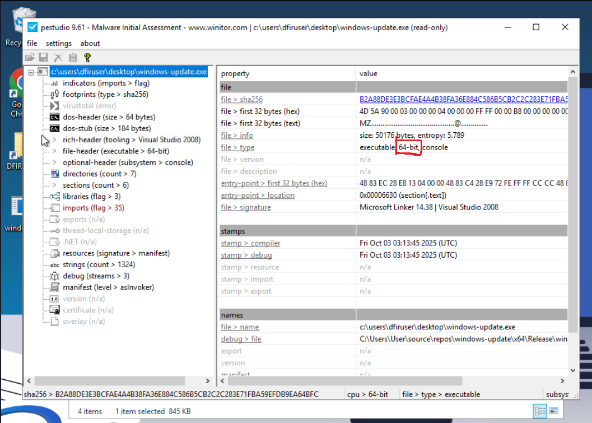
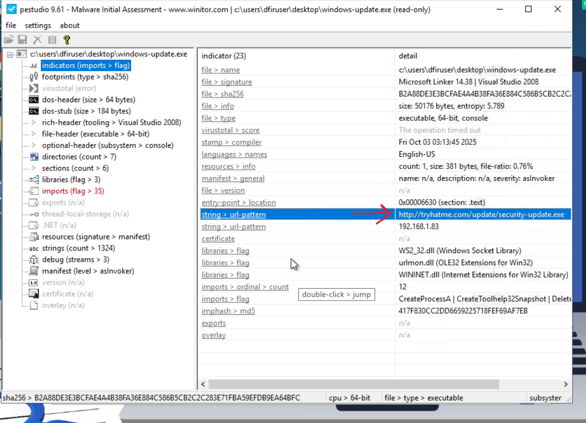
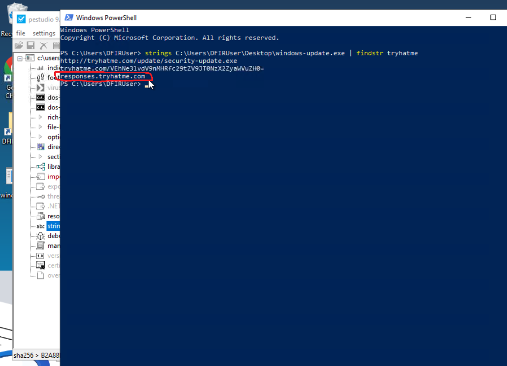
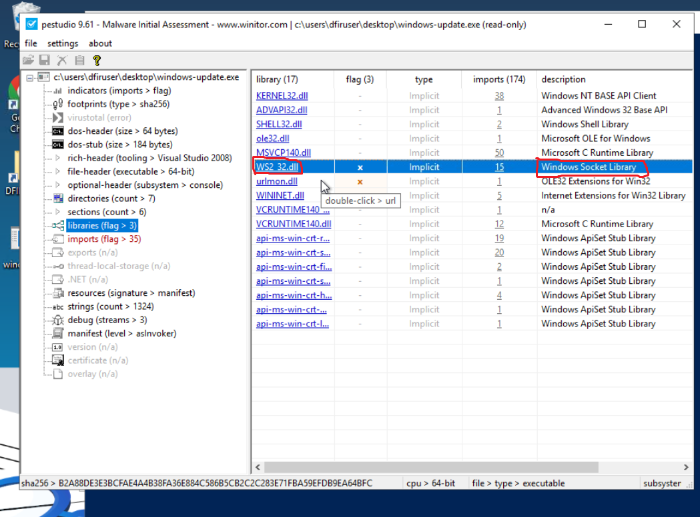
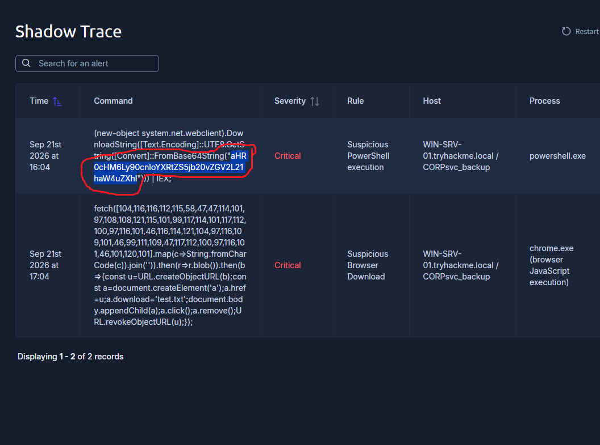
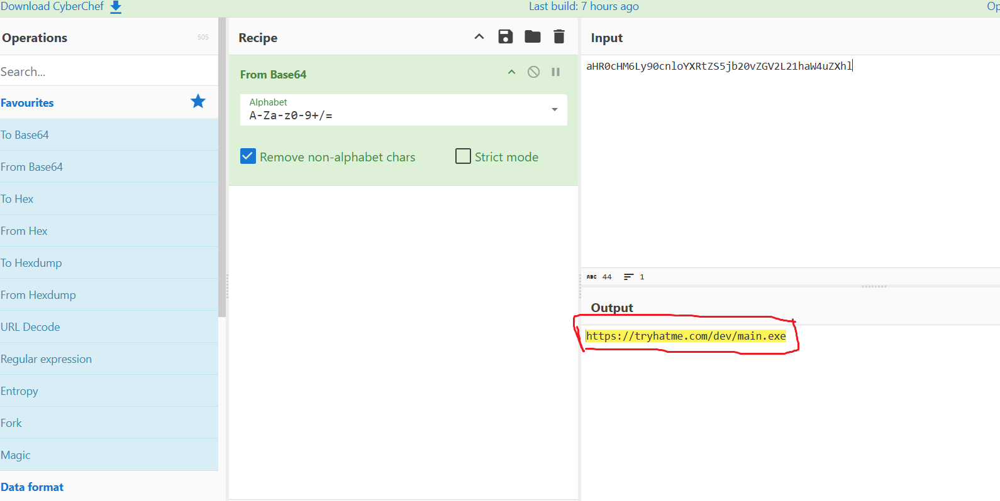
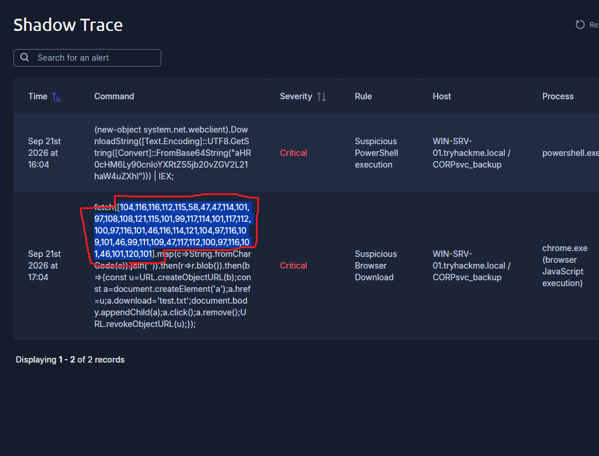
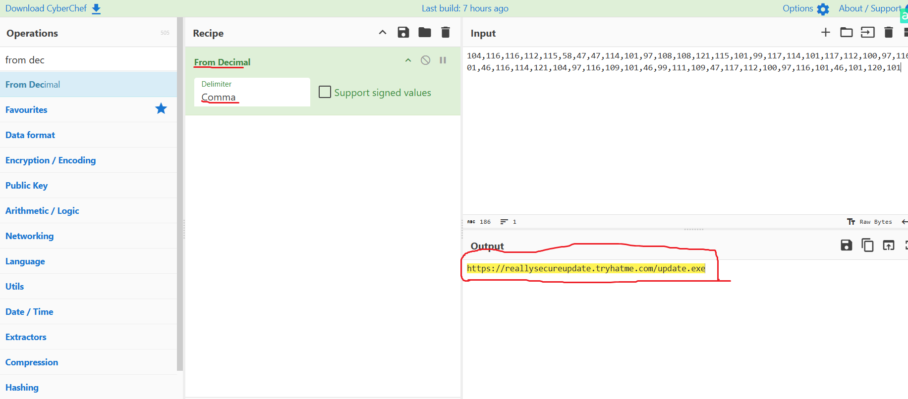

# Shadow Trace

## Overview

Shadow Trace is a TryHackMe CTF challenge focused on malware and alert analysis.

I investigated a suspicious file named `windows-update.exe` using DFIR tools available on the provided virtual machine. I also analyzed suspicious PowerShell and browser alerts to identify hidden information and potential indicators of compromise.

## Tools Used

- PEStudio
- Strings
- PowerShell
- CyberChef

## Static Analysis

I opened the suspicious `windows-update.exe` file in PEStudio to perform static analysis and collect information about the file without executing it.

### File Information

Using PEStudio, I identified that the executable has a 64-bit architecture.

I also found its SHA-256 hash:

`b2a88de3e3bcfae4a4b38fa36e884c586b5cb2c2c283e71fba59efdb9ea64bfc`



### IOC Identification

PEStudio showed a suspicious URL inside the executable:

`http://tryhatme.com/update/security-update.exe`



To search for additional related strings, I used the following PowerShell command:

```powershell
strings C:\Users\DFIRUser\Desktop\windows-update.exe | findstr tryhatme
```

This helped me find another domain:

`responses.tryhatme.com`

The output also contained Base64-encoded data, which I later decoded using CyberChef.



### Network-related Libraries

During static analysis, I found that the executable imports `WS2_32.dll`.

`WS2_32.dll` is the Windows Sockets library and provides functions that applications can use for network communication.

Its presence does not automatically mean that a file is malicious, but it was useful information while investigating the network-related capabilities of the suspicious executable.



## Alert Investigation

### PowerShell Alert

In the PowerShell alert, I found a suspicious command containing a Base64-encoded value.

The command used `FromBase64String()`, which indicated that Base64 decoding was being performed.



I extracted the encoded value and used CyberChef to decode it.

The decoded value revealed the following URL:

`https://tryhatme.com/dev/main.exe`



### Browser Alert

In the `chrome.exe` alert, I noticed a long sequence of decimal numbers.

The JavaScript command contained `String.fromCharCode()`, which suggested that the numbers were being converted into characters.



I copied the decimal values into CyberChef and used the `From Decimal` operation.

After decoding them, I found the following URL:

`https://reallysecureupdate.tryhatme.com/update.exe`



The alert also showed that the downloaded file was saved as `test.txt`.

## Indicators of Compromise

| Type | Indicator |
| --- | --- |
| SHA-256 | `b2a88de3e3bcfae4a4b38fa36e884c586b5cb2c2c283e71fba59efdb9ea64bfc` |
| URL | `http://tryhatme.com/update/security-update.exe` |
| Domain | `responses.tryhatme.com` |
| URL | `https://tryhatme.com/dev/main.exe` |
| URL | `https://reallysecureupdate.tryhatme.com/update.exe` |

> These indicators are part of the TryHackMe lab environment and are included for educational purposes.

## What I Learned

During this challenge, I learned where to find important information about a suspicious executable in PEStudio.

I also learned how to use `strings` together with `findstr` to quickly search for specific information inside an executable.

I reinforced my knowledge of Base64 decoding and learned how decimal values can be used to hide strings inside JavaScript.

Most importantly, this challenge helped me practice combining information from static file analysis and security alerts instead of looking at each source separately.

## Conclusion

The investigation took me approximately 45 minutes.

During the challenge, I performed basic static analysis of a suspicious executable, extracted indicators, investigated suspicious PowerShell and browser activity, and decoded hidden information using CyberChef.

This challenge gave me more practice with tools and techniques that I had previously learned in other TryHackMe rooms.
