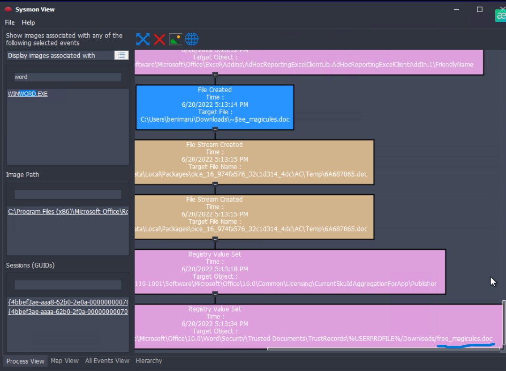
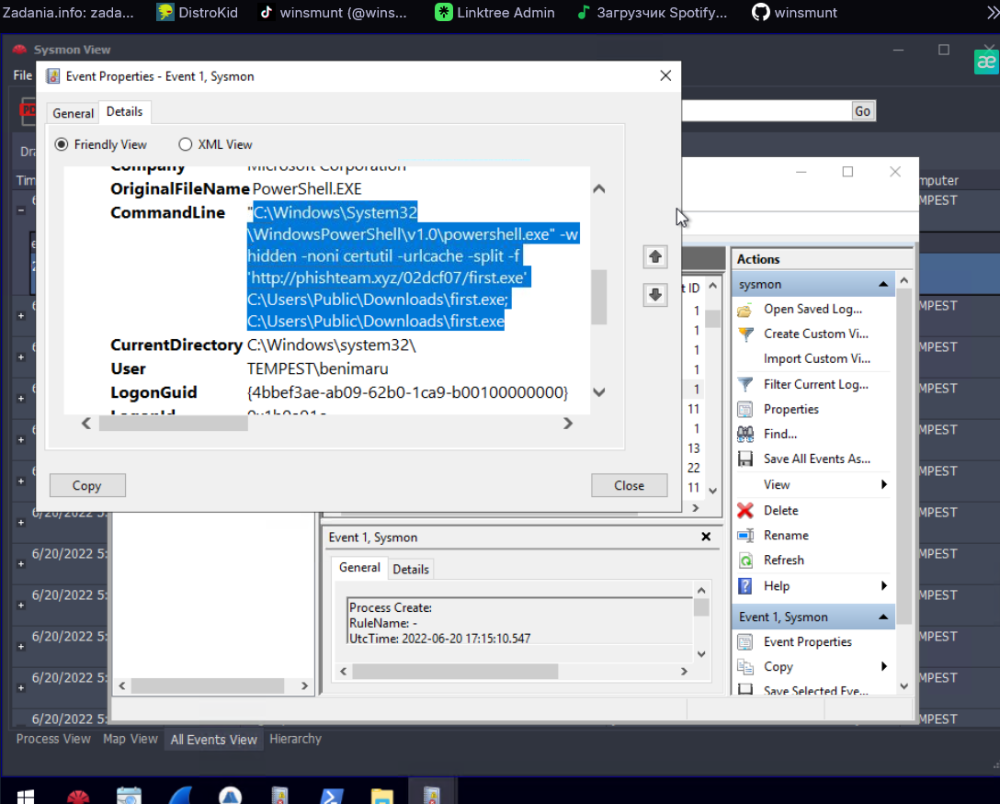
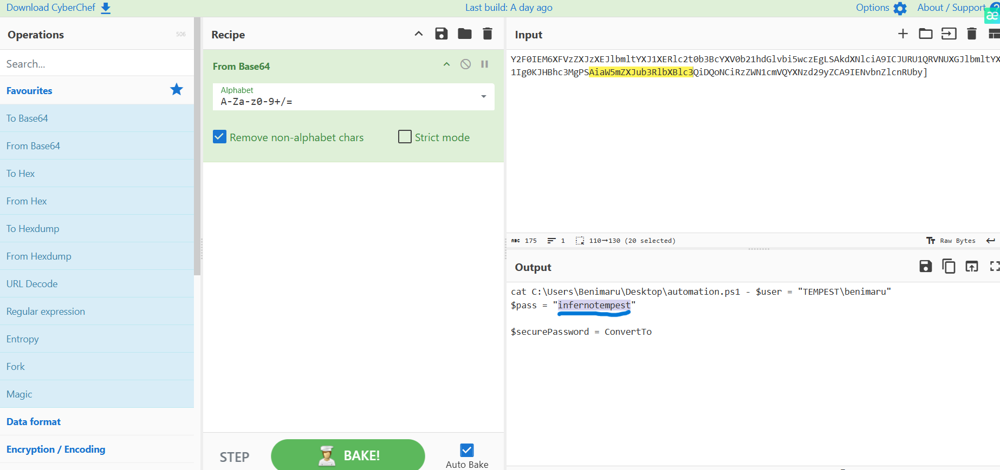
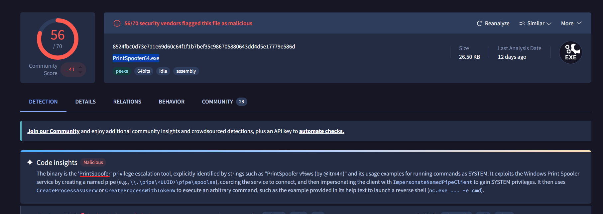
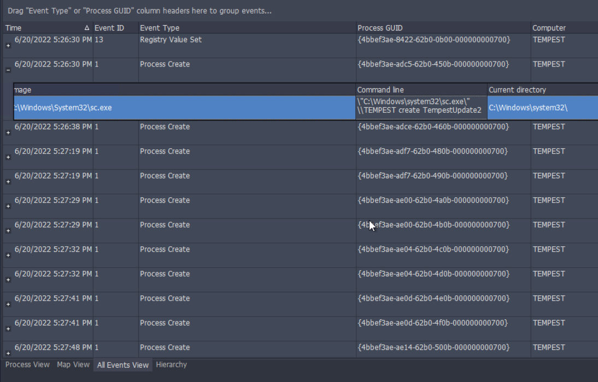
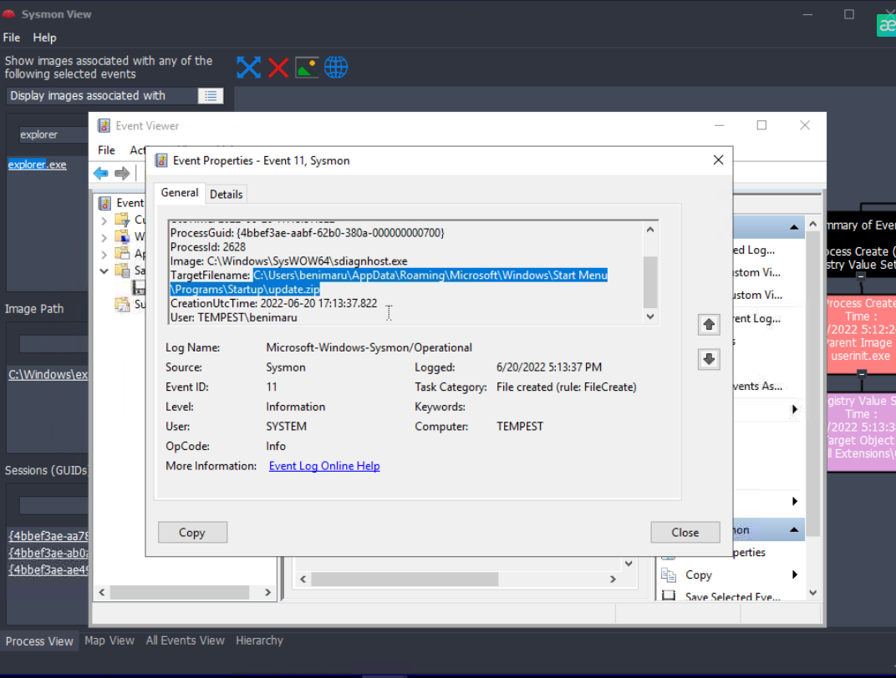
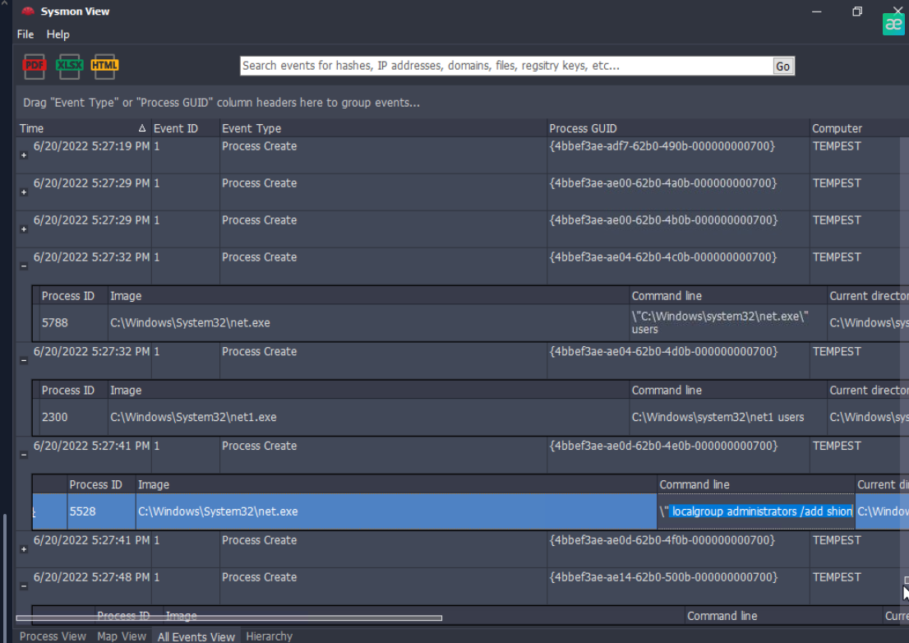
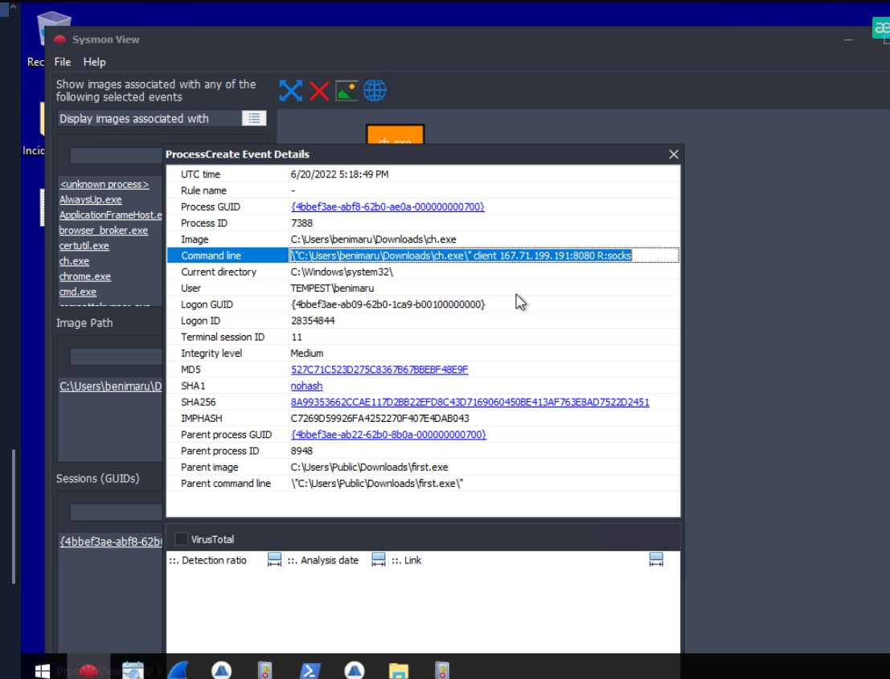
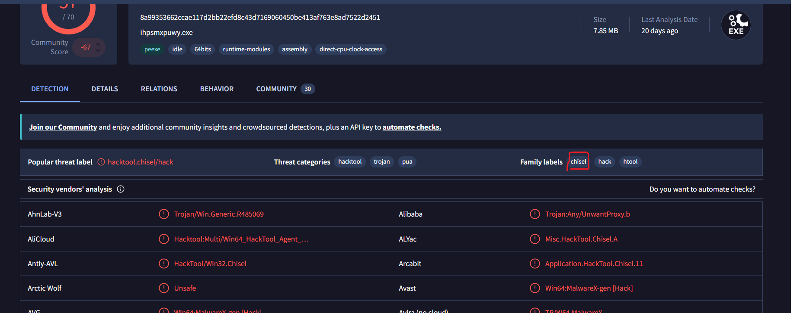
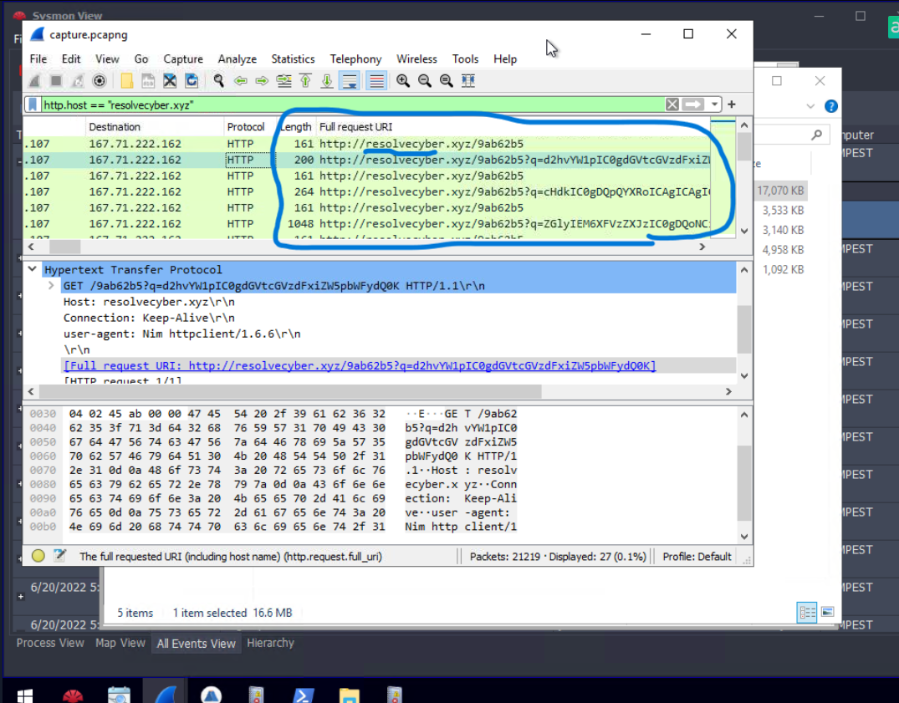

# Tempest - Incident Investigation

## Overview

This challenge involved investigating a compromised Windows machine using Sysmon logs and network traffic.

The investigation covered the attack chain from the initial malicious document and payload download to privilege escalation, persistence, credential exposure, tunneling, and command-and-control activity.

## Tools Used

- Sysmon View
- Windows Event Viewer
- Wireshark
- VirusTotal
- CyberChef

## Investigation

### 1. Initial Access

The investigation showed that the user downloaded and opened a suspicious Microsoft Word document named:

`free_magicules.doc`

Sysmon events confirmed activity related to the document shortly after it was downloaded.

### 2. Payload Download

Further investigation of process creation events revealed that PowerShell was used to download an executable from an external domain.

The command used PowerShell with hidden window execution and downloaded:

`first.exe`

from:

`phishteam.xyz`

The executable was stored in the Public Downloads directory and executed.

### 3. Credential Exposure

During the investigation, Base64-encoded data was identified and decoded using CyberChef.

The decoded content revealed a PowerShell automation script containing credentials associated with the compromised user account.

This demonstrated how sensitive information stored inside scripts can become useful to an attacker after gaining access to a system.

### 4. Privilege Escalation

A suspicious executable was identified and its SHA-256 hash was analyzed using VirusTotal.

The file was identified as **PrintSpoofer**, a Windows privilege escalation tool that can abuse the Print Spooler service to obtain SYSTEM-level privileges.

### 5. Persistence

The attacker established persistence using multiple techniques.

#### Windows Service

Sysmon recorded the creation of a new Windows service named:

`TempestUpdate2`

The service was created using `sc.exe`.

#### Startup Folder

Another persistence mechanism was identified through a file creation event involving:

`update.zip`

inside the Windows Startup directory.

Files placed in this location can execute automatically when the user logs in.

### 6. Account and Group Modification

Process creation events showed the attacker using Windows `net.exe` and `net1.exe` utilities.

One of the observed commands modified membership of the local Administrators group.

This activity is significant because adding an account to the Administrators group provides persistent elevated access to the system.

### 7. Chisel Execution

Another suspicious executable, `ch.exe`, was discovered during the investigation.

The process command line showed it connecting to an external IP address using a SOCKS configuration.

The executable hash was investigated using VirusTotal and identified as **Chisel**.

Chisel is a tunneling tool that can be used to create network tunnels and proxy traffic through compromised systems.

### 8. Command-and-Control Traffic

Network traffic was analyzed in Wireshark.

Filtering HTTP traffic revealed repeated connections to:

`resolvecyber.xyz`

The requests contained encoded data inside HTTP query parameters.

This traffic was consistent with command-and-control communication between the compromised machine and external infrastructure.

## Attack Chain

Based on the collected evidence, the activity can be summarized as:

`Malicious document → PowerShell payload download → Payload execution → Credential exposure → Privilege escalation → Persistence → Chisel tunneling → C2 communication`

## Indicators of Compromise

| Type | Indicator |
|---|---|
| Malicious document | `free_magicules.doc` |
| Downloaded payload | `first.exe` |
| Payload domain | `phishteam.xyz` |
| C2 domain | `resolvecyber.xyz` |
| Tunneling tool | `ch.exe` / Chisel |
| Privilege escalation tool | PrintSpoofer |
| Persistence service | `TempestUpdate2` |
| Startup artifact | `update.zip` |

## What I Learned

This challenge gave me practical experience investigating an attack across both host and network telemetry.

The most useful part was correlating different sources of evidence instead of analyzing individual events in isolation. Sysmon helped identify process execution, persistence, and file activity, while Wireshark provided visibility into network communication.

I also gained more experience with:

- tracing parent and child processes;
- analyzing suspicious PowerShell commands;
- identifying persistence mechanisms;
- using file hashes to investigate suspicious executables;
- recognizing tunneling tools such as Chisel;
- analyzing HTTP-based C2 traffic;
- decoding suspicious data with CyberChef.

## Conclusion

The investigation demonstrated a multi-stage Windows compromise involving malicious document execution, payload delivery, privilege escalation, persistence, tunneling, and command-and-control communication.

The challenge was especially useful for practicing how separate host and network artifacts can be combined to reconstruct an attack timeline.
